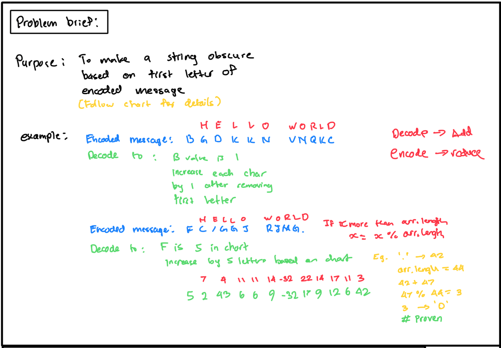
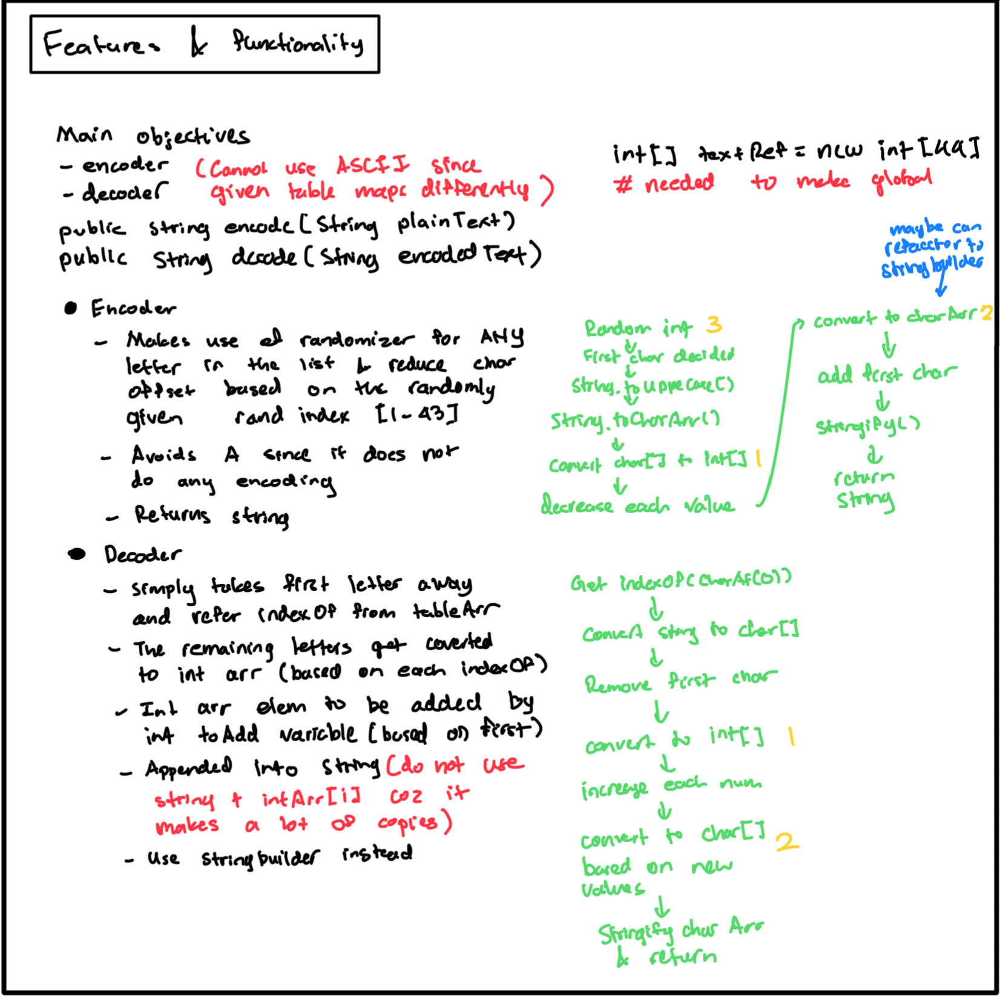
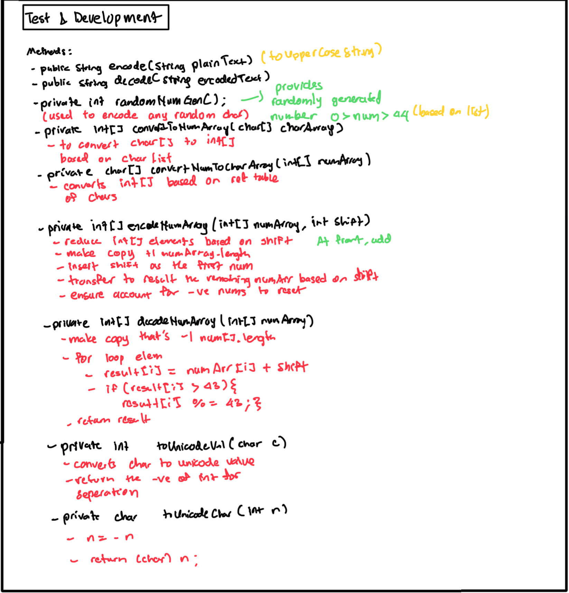

# Encoder

## Story of Possible Uses
This project can be particularly useful for system administrators who need to encrypt and decrypt password files for better privacy and security. It showcases a simple yet effective way to encode and decode text, ensuring that sensitive information is protected.

## Quick Start Guide
1. **Clone the repository**:
    ```bash
    git clone https://github.com/andriSyazwan/Encoder.git
    ```
2. **Configure JDK**:
    - Ensure that JDK 21 is installed and configured. You might need to set the JAVA_HOME environment variable to point to your JDK 21 installation.
3. **Open the Project**:
    - Open the project in your preferred IDE (IntelliJ IDEA is recommended).
4. **Build and Update Maven Project**:
    - In IntelliJ, right-click on the project and select `Maven` > `Reload Project`.
5. **Run the Application**:
    - Run the `SpecialEncodingApp` class.
    - Follow the instructions in the terminal to encode or decode text.
6. **Enjoy**:
    - Feel like a hacker as you play around with encoding and decoding text.

## Development Description
- **Test-Driven Development (TDD)**: The application was developed using TDD to ensure robustness and reliability.
- **JUnit**: Used for writing and running tests to verify the functionality of the application.

## Functions and Features
- **Randomizer for Encoding**: Utilizes a random number generator to encode text.
- **Case Handling**: Accepts lowercase inputs but always returns uppercase encoded text.
- **Object-Oriented Programming (OOP)**: The application is built with OOP principles in mind.

## Demonstration of OOP
- **Encapsulation**: 
    - Private attributes and methods are used within the `Solution` class to ensure data integrity and hide implementation details.
- **Abstraction**:
    - Provides getter methods to access object attributes without exposing internal implementations.
- **Inheritance**:
    - Main methods implement an interface, allowing for flexible and extendable code.
- **Polymorphism**:
    - Method overriding is used to provide different implementations of the same method, enabling various usages.

## Future Considerations
- **File Handling**:
    - Extend the scanner to accept files, encode the text within the file, and output a file with the encoded text. This will enhance the usability of the application for batch processing.

## Appendix
### Notes




---

Feel free to reach out if you have any questions or need further assistance. Enjoy using the Encoder!